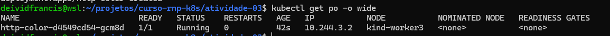
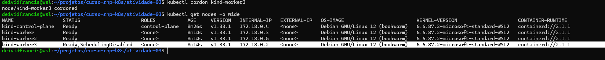
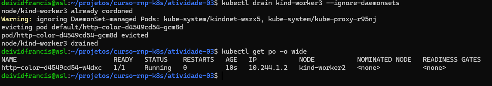
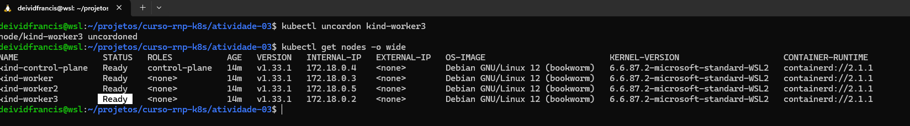

# TAREFA 3

- 1. fazer deploy de uma app dentro do cluster (yaml)

- 2. identificar em que node está sendo executado

- 3. deixar o node acima indisponivel

- 4. observar o comportamento da ap, para qual node ela foi alocada

- 5. restabelecer o node

## Resolução

- Estou aproveitando o cluster da ativiade passada

### Step 1
- Deploy da aplicação no kubernetes

```sh
kubectl apply -f deployment.yaml
```

### Step 2
- `kubectl get po -o wide`

O Deploy foi feito no kind-worker3




### Step 3

- `kubectl cordon kind-worker3`



- `kubectl drain kind-worker3 --ignore-daemonsets` 



### Step 4

- O Deploy foi ralocado para o kind-worker2

### Step 5

- `kubectl uncordon kind-worker3`


