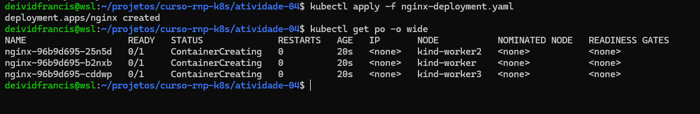
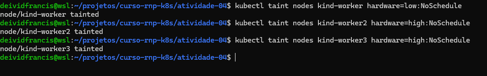
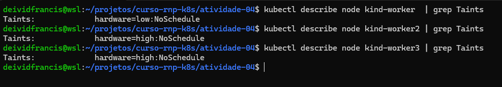
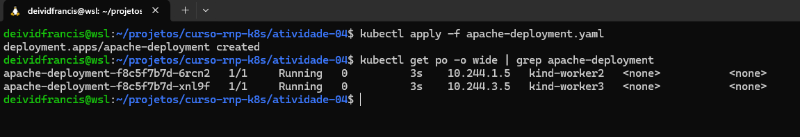
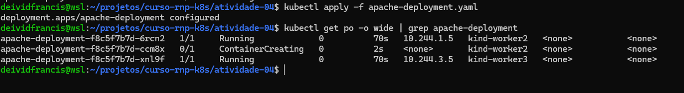

### Cenário

Considerando o uso do kind, crie um cluster com 3 nodes workrs representando o nodepool A e 2 nodes workers representando o nodepool B

A ideia é que os nodes pools tenham esta característica: (no caso do kind isso ficará apenas convencionado os nodepools serão iguais)

nodepool - tipo A

 - hardware=low

 - Apps básicas = ngnix

 

nodepool - tipo B

 - hardware=high

 - Apps Criticas = apache


# Tarefa 4:

- 1. Fazer o deploy do nginx sem ter configurado taints e tolerations

- 2. Configurar taint e tolerations

- 3. Fazer o deploy de apache


## Resolução

- Estou aproveitando o cluster da `ativiade-01`

### Step 1

- `kubectl apply -f nginx-deployment.yaml`



### Step 2

- Temos o seguinte cluste
```sh
NAME                 STATUS   ROLES           AGE   VERSION
kind-control-plane   Ready    control-plane   39m   v1.33.1
kind-worker          Ready    <none>          39m   v1.33.1
kind-worker2         Ready    <none>          39m   v1.33.1
kind-worker3         Ready    <none>          39m   v1.33.1
```

- Aplicar os seguintes Taints

```sh
kubectl taint nodes kind-worker hardware=low:NoSchedule
kubectl taint nodes kind-worker2 hardware=high:NoSchedule
kubectl taint nodes kind-worker3 hardware=high:NoSchedule
```

- output


- Verificar de os Taits foram aplicados

```sh
kubectl describe node kind-worker  | grep Taints
kubectl describe node kind-worker2 | grep Taints
kubectl describe node kind-worker3 | grep Taints

```

- output



### Step 3

- `kubectl apply -f apache-deployment.yaml` 

- output


- Por mais que suba o numero de replicas os pods so vao ser alocados seguindo a regra de Taits presente no deployment.yaml

- output

