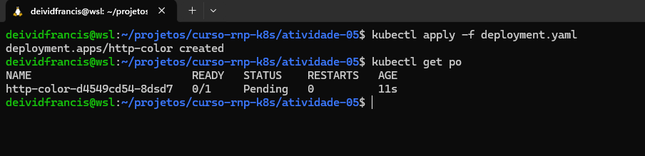

# Tarefa 05

- Criar um deployment para uma app qualquer
- Configurar o deployment para instanciar 10 replicas
- Fazer o deploy 
- Deixar em um terminal o status do rollout
- Trocar a versão da image da app
- Reprovisionar e verificar andamento do rollout
- Reverter a app para a versão anterior e  verificar o andamento do rollout

## Resolução

- Estou aproveitando o cluster da ativiade passada
- Usando como imagem base https://github.com/DeividFrancis/http-color.git

### Step 1

- Deploy da aplicação no kubernetes
- Tem somente uma replica

```sh
kubectl apply -f deployment.yaml
```




### Step 2

- Ajustando para 10 replicas

```sh
kubectl apply -f deployment.yaml
```


### Step 3

- `watch kubectl rollout status deployment/http-color`


### Step 4

- Trocar a versão da image da app de `red` pra `green`
- Reprovisionar e verificar andamento do rollout


### Step 5

- Reverter a app para a versão anterior e  verificar o andamento do rollout
- `kubectl rollout undo deployment/http-color` 


