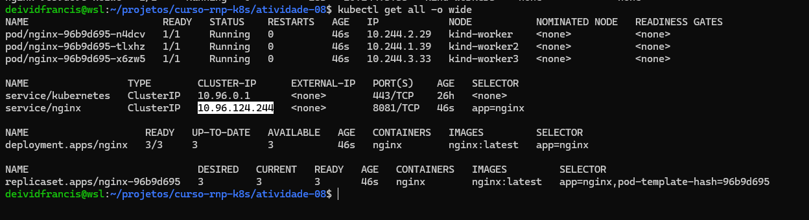
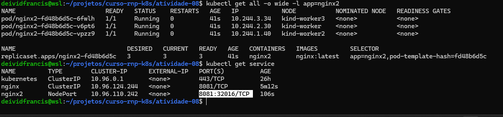
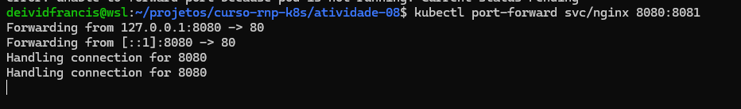
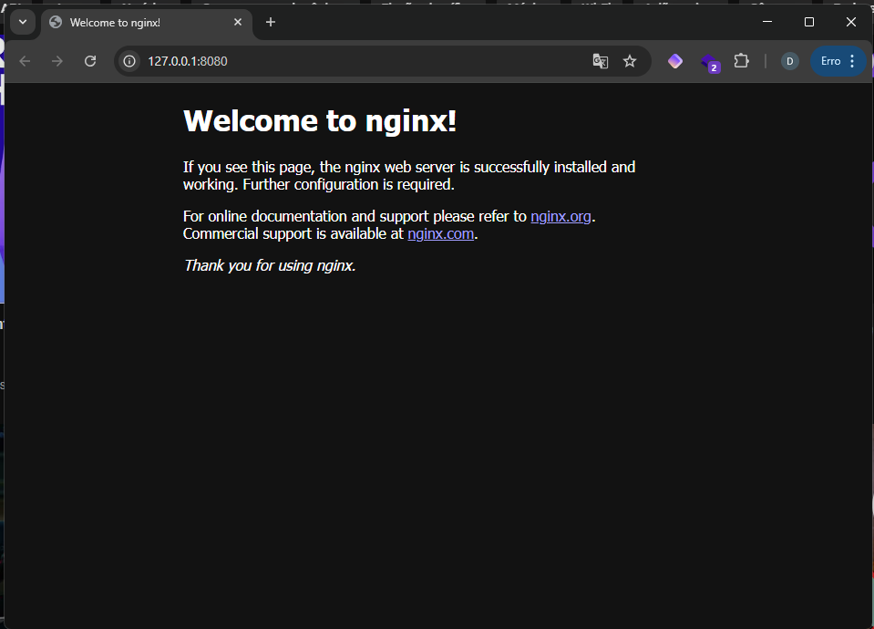
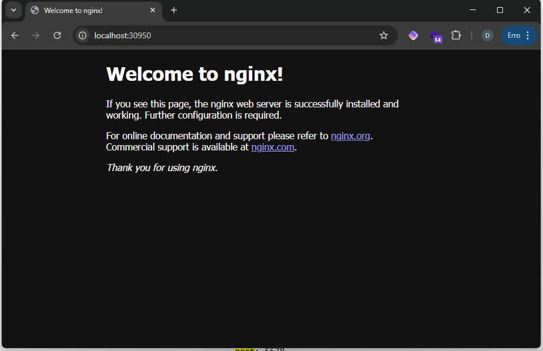

# Tarefa 08

- Criar um deployment  e um serviço (Ip cluster) para a app nginx
- Criar um deployment e um seviçco (NodePort) para a app nginx2
- Demonstrar as formas de acesso "por fora do cluster" via curl e browser


## Resolução

- Subir cluster a partir de uma configuração para expor portas no kind
https://kind.sigs.k8s.io/docs/user/configuration/#extra-port-mappings

```sh
kind create cluster --config cluster-config.yaml
```
## Step 1

- deploy cluster IP `kubectl apply -f nginx-cluster-ip.yaml`



## Step 2

- deploy Node port `kubectl apply -f nginx-node-port.yaml`



## Step 3

- Acessar os sites

#### Cluster IP https://localhost:8080



#### Node Port https://localhost:30950
