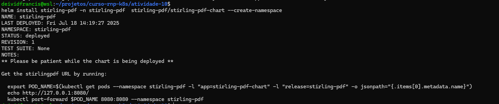
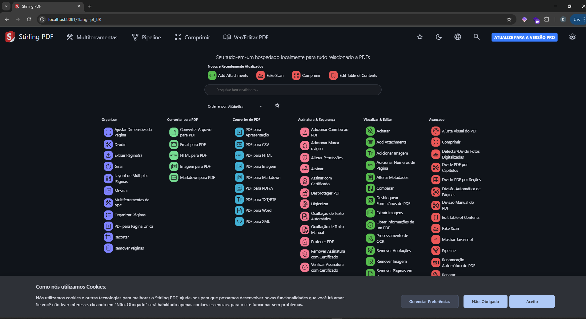
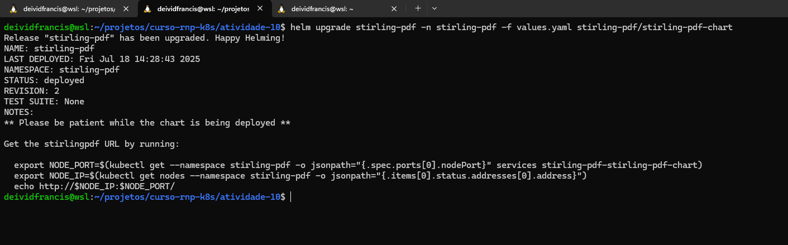
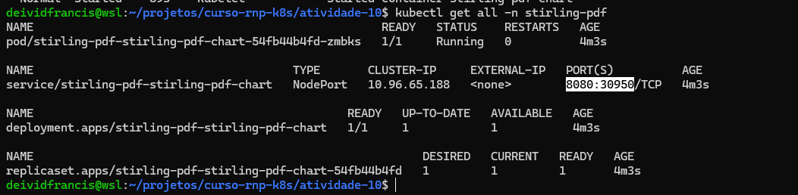

# Tarefa 10

- Via Helm fazer o deploy de uma app a escolher.
- Modificar algum parametro de coinfiguração na app (values.yaml)
- Fazer o deploy com as novas configurações

## Resolução

- Estou aproveitando o cluster da `ativiade-08`
- Instalr [Helm Cli](https://helm.sh/docs/intro/install/)

### Step 1

- Escolhi o app [Stirling PDF](https://github.com/Stirling-Tools/Stirling-PDF)
- Add repo: `helm repo add stirling-pdf https://docs.stirlingpdf.com/Stirling-PDF-chart` 
- Atualiza repo `helm update`
- Instala: `helm install stirling-pdf -n stirling-pdf  stirling-pdf/stirling-pdf-chart --create-namespace`
- Expor para teste: `kubectl port-forward service/stirling-pdf-stirling-pdf-chart 8080:8081 -n stirling-pdf`

### Step 2

- Criei arquivo `values.yaml` e adicionei config para usar NodePort

- Atualizar `helm upgrade stirling-pdf -n stirling-pdf -f values.yaml stirling-pdf/stirling-pdf-chart`

- As aplicações deram certo ao rodar `kubectl get all -n stirling-pdf` pode observar que existe a porta configurada.

